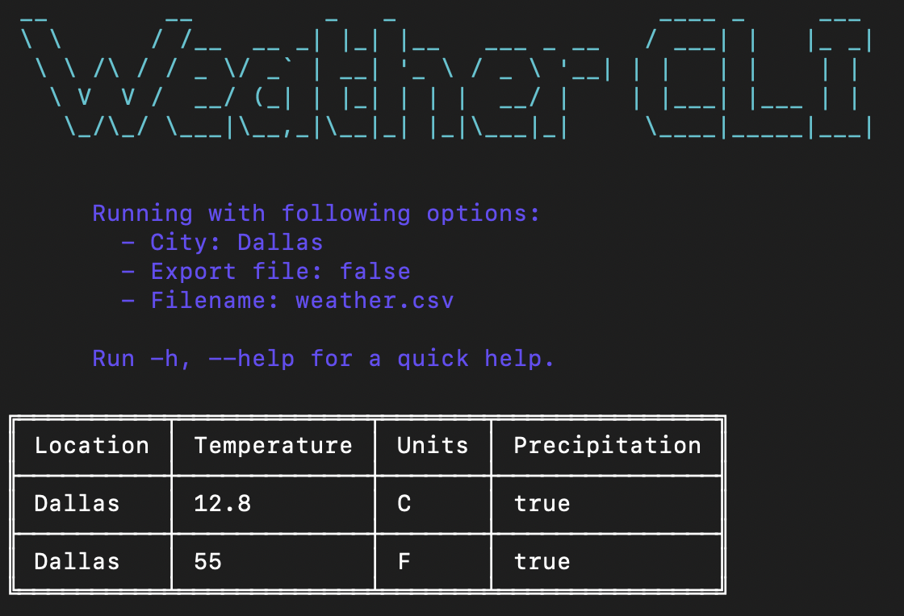

# weather-cli

JS CLI to consume [Weather API](https://www.weatherapi.com).



## Setup
1. Copy `.env.example` file into a new one called `.env`.
```sh
# Unix
$ cp .env.example .env
```

2. Get an API key from [Weather API](https://www.weatherapi.com) and write it down in `WEATHER_API_KEY` variable in `.env` file.

3. Run CLI.
```sh
# Development
$ npm run dev

# Production
$ npm run build && node dist/index.js
```

## Options
- -c, --city
> Set city to look for weather information. Default: Dallas.
```sh
$ node dist/index.js -c Mexico City
$ node dist/index.js --city Mexico City
```

- -e, --export
> Export weather information as a CSV file. Default: false.
```sh
$ node dist/index.js -e
$ node dist/index.js --export
```
